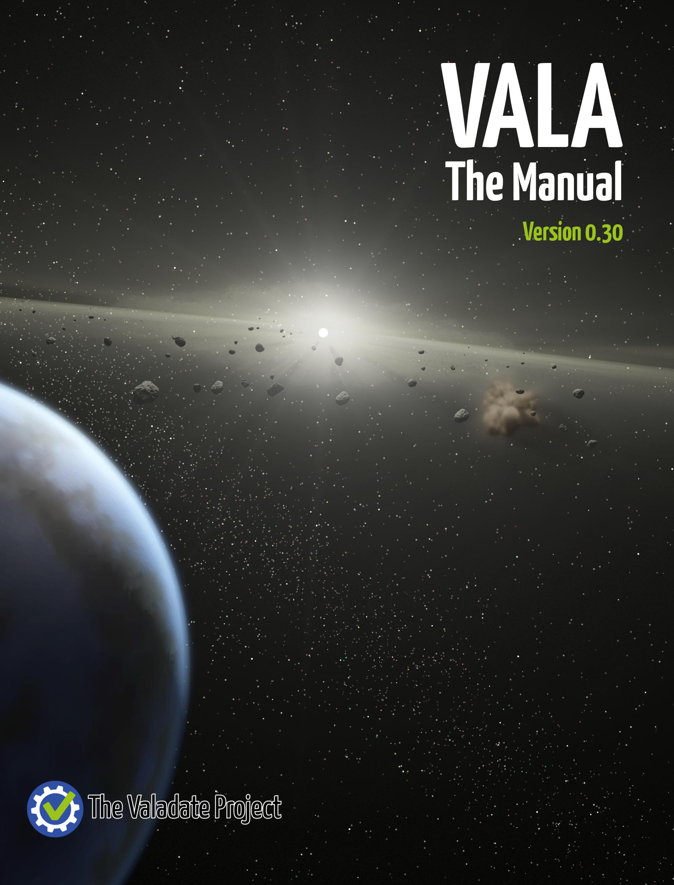

# The Vala Manual Project

##### The Vala Manual is an initiative of the [Valadate Project](http://www.valadate.org).

### Roadmap
|Date|Item|
|---|---|
|30 July 2016|Full English Version Complete for Vala 0.30|
|1 August 2016|Launch Crowd-in project to translate to Spanish, Portuguese and Polish|

Cover Image: By NASA/JPL-Caltech - [NASA Image of the Day](https://commons.wikimedia.org/w/index.php?curid=10197951), Public Domain, 
